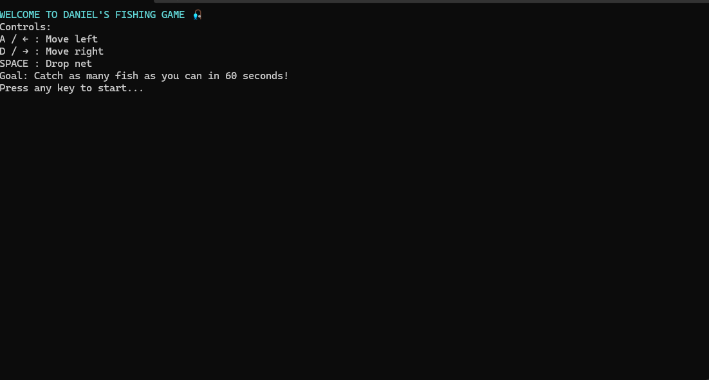
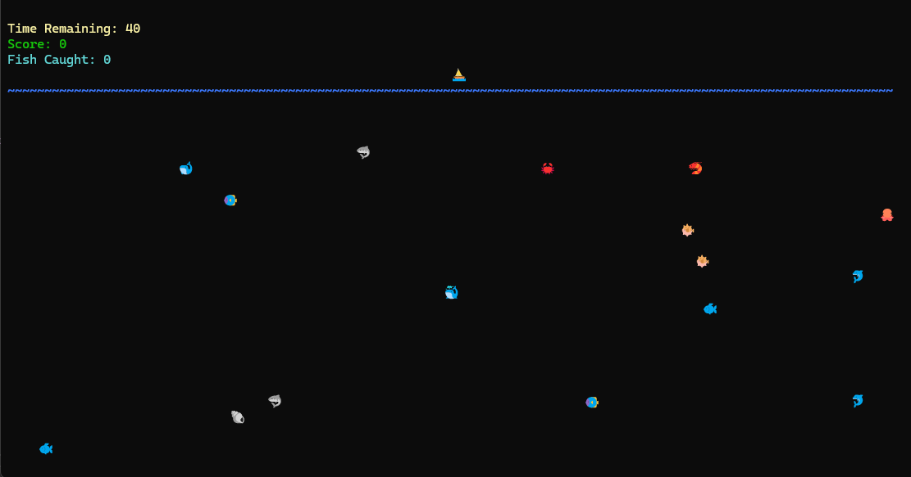
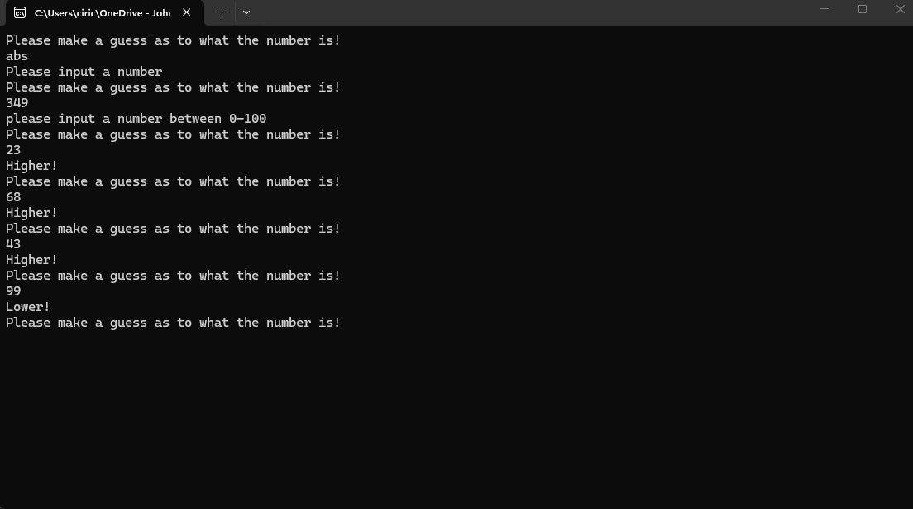

# My Programming Projects.

### Programming 1 Final Project: Fishing Game
This is a fishing game I made using Object Oriented Programming in P1, here is the Draw Method I used. This was all done on VS Studio 2022 C# with the .NET 8.0 framework.

[Github Repo](https://github.com/ChohanProgrammingProjects/Programming-1-Final-Project)
````C#
       static void Draw()
        {
            // Draw Timer
            Console.SetCursorPosition(0, 1);
            Console.ForegroundColor = ConsoleColor.Yellow;
            Console.Write("Time Remaining: " + timer + "  "); //Spaces after the variable to eliminate the leftover digits when the timer goes <10
            Console.ResetColor();

            //Draw Score
            Console.SetCursorPosition(0, 2);
            Console.ForegroundColor = ConsoleColor.Green;
            Console.Write("Score: " + score);
            Console.ResetColor();

            //Draw Fish counter
            Console.SetCursorPosition(0, 3);
            Console.ForegroundColor = ConsoleColor.Cyan;
            Console.Write("Fish Caught: " + fishcaught);
            Console.ResetColor();

            // Draw the waterline across the screen
            Console.SetCursorPosition(0, waterline.WaterLineY);
            Console.ForegroundColor = ConsoleColor.Blue;
            for (int i = 0; i < Console.WindowWidth; i++)
            {
                Console.Write(Water.WaterSymbol);
            }
            Console.ResetColor();

            // Clear old boat position
            if (Boat.OldBoatX >= 0 && Boat.OldBoatX < Console.WindowWidth && Boat.OldBoatY >= 0 && Boat.OldBoatY < Console.WindowHeight)
            {
                Console.SetCursorPosition(Boat.OldBoatX, Boat.OldBoatY);

                if (Boat.OldBoatY == waterline.WaterLineY)
                {
                    // Restore waterline where the boat used to be
                    Console.ForegroundColor = ConsoleColor.Blue;
                    Console.Write(Water.WaterSymbol);
                    Console.ResetColor();
                }
                else
                {
                    Console.Write(" ");
                }
            }

            // Draw Boat
            Console.SetCursorPosition(Boat.BoatX, Boat.BoatY);
            Console.Write(Boat.BoatSymbol);

            // Clear the column under the boat (removes old net pieces (the extra chains), but not the waterline)
            for (int i = Boat.BoatY + 1; i < Console.WindowHeight - 1; i++)
            {
                if (i == waterline.WaterLineY)
                    continue; // don't erase the waterline here

                Console.SetCursorPosition(Boat.BoatX, i);
                Console.Write(" ");
            }

            // Draw net (only while fishing)
            if (Boat.IsFishing)
            {
                Console.ForegroundColor = ConsoleColor.Cyan;
                for (int i = Boat.BoatY + 1; i <= Boat.NetY && i < Console.WindowHeight - 1; i++)
                {
                    Console.SetCursorPosition(Boat.BoatX, i);
                    Console.Write("🔗");      //chain represents a massive fishing net
                }
                Console.ResetColor();
            }

            // Draw fish
            for (int i = 0; i < fishArray.Length; i++)
            {
                Fish f = fishArray[i];

                if (!f.IsAlive)
                    continue;

                // Clear old position if changed
                if (f.OldFishX != f.FishX || f.OldFishY != f.FishY)
                {
                    if (f.OldFishX >= 0 && f.OldFishX < Console.WindowWidth && f.OldFishY >= 0 && f.OldFishY < Console.WindowHeight)
                    {
                        Console.SetCursorPosition(f.OldFishX, f.OldFishY);
                        Console.Write(" ");
                    }
                }

                // Draw new position
                if (f.FishX >= 0 && f.FishX < Console.WindowWidth && f.FishY >= 0 && f.FishY < Console.WindowHeight)
                {
                    Console.SetCursorPosition(f.FishX, f.FishY);
                    Console.Write(f.FishSymbol);
                }
            }
        }
````



## What I learned
I learned about classes and objects as my professor challenged me to teach myself object oriented programming. I also learned the ins and outs of game development from design to debugging.

### Random Number Guesser - Programming 1.

````c#
            static void rngguesser()
            {
                Console.Clear();

                int number;
                Random rand = new Random();
                number = rand.Next(100);
                int Guess;
                Guess = -1;
                bool isInt = false, isInRange = false;

                // Main Menu of Game
                Console.WriteLine("Welcome to the guessing game! The purpose of this game is to try and guess the randomly generated number!");
                Console.WriteLine("--PRESS ANY KEY TO CONTINUE--");
                Console.ReadLine();
                Console.Clear();

                while (Guess != number)
                {
                    Console.WriteLine("Please make a guess as to what the number is!");
                    isInt = int.TryParse(Console.ReadLine(), out Guess); 
                                                                        
                    if (!isInt) //is the isInt false? do this!
                    {
                        Console.WriteLine("Please input a number"); //tell the user it needs to be a num
                    }

                    if (Guess < 0 || Guess > 100) //this checks if guess is less than 0, OR more than 100
                    {
                        isInRange = false;
                        Console.WriteLine("please input a number between 0-100");
                    }
                    else //if the above if statement doesnt run, it means the guess is in range
                    {
                        isInRange = true;
                    }
                    if (isInRange && isInt) //this if statement checks if the guess is both in range AND is an int
                    {
                        if (Guess > number)
                        {
                            Console.WriteLine("Lower!");
                        }
                        else if (Guess < number)
                        {
                            Console.WriteLine("Higher!");
                        }
                    }
                }

                //Display Results and Exit Menu
                Console.Clear();
                Console.WriteLine("Well done! You got it! the number was " + number);
                Console.WriteLine("--PRESS ANY KEY TO CONTINUE--");
                Console.ReadLine();
            }
````    


## What I learned
Doing this game taught me early on how to do input validation as well as how to get a random number in C#.